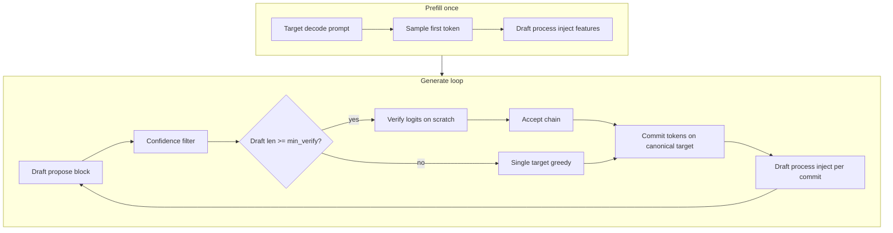

# DSpark: pipeline refactor plan (explicit propose-verify-commit loop)

This document plans a refactor of DSpark speculative decoding to match the **explicit pipeline** described below. Goal: clear data ownership, predictable control flow, and performance from batched verify inside an isolated logits phase.

**Companion doc:** [dspark-refactor-kv-safety.md](dspark-refactor-kv-safety.md) (invariants and memory domains).

---

## Target pipeline (authoritative semantics)

This is the loop we want. Names map to planned functions.

```
PREFILL (once)
  1. Target: process full prompt on ctx_tgt (canonical KV)
  2. Draft:   inject target features from prefill into ctx_dft (via process)
  3. Sample first generated token from target (greedy at temp=0)

GENERATE (repeat until EOS or n_predict)
  3. Draft propose: run draft model for up to block_size tokens (n_max, default 7)
  4. Confidence:  truncate proposed block by confidence threshold
  5. Verify gate: if filtered block length >= min_verify (e.g. 1 or 2), run verify
  6. Verify:      target logits for [anchor + draft prefix] (does NOT touch canonical KV)
  7. Accept:      greedy accept contiguous prefix from row 0; stop at first draft mismatch
  8. Commit:      for each accepted target token (+ bonus token):
                    - one target decode on canonical KV
                    - dspark process (target layer taps -> draft encoder -> draft KV inject)
  9. If draft block empty or verify skipped: commit exactly one target token (step 8 with n=1)
 10. Advance n_past, trim draft/target tail KV beyond n_past, goto 3
```

### Clarifications vs informal description

| Question | Answer |
|----------|--------|
| Separate prompt on draft? | Draft does not tokenize prompt independently. Target prefill runs first; `process()` copies **target layer features** per prompt position into draft KV. Equivalent to "draft sees the prompt" via conditioning. |
| Draft never affects output? | Correct at temp=0. Draft only proposes; target verify + commit defines output. |
| Zero accepts? | Speculative decode always advances **at least one** target token per iteration (the bonus token after the accept chain). You never stall. |
| When is verify skipped? | Optional optimization: if `draft.size() < min_verify`, go straight to single-token target commit. Default: verify whenever `draft.size() > 0`. |
| Confidence at 0 | Confidence head disabled; full block (up to n_max) proposed. |

---

## Current code vs target pipeline

| Pipeline step | Current location | Gap |
|---------------|------------------|-----|
| Target prefill | `run_speculative()` in `tests/compare_vanilla_speculative.cpp`; server equivalent in `server-context.cpp` | Logic duplicated; should move to `dspark_pipeline_prefill()` |
| Draft conditioning | `common_speculative_impl_draft_dspark::process()` | OK; needs clearer "draft domain only" boundary |
| Draft propose | `common_speculative_draft()` -> `draft_dspark::draft()` | OK |
| Confidence filter | inside `draft()` | OK |
| Verify | `common_speculative_dspark_verify_batched()` or `_sequential()` | Monolithic; batched mixed phases until scratch fix |
| Accept | inside verify via `common_sampler_sample_and_accept_n()` | Should be separate pure function |
| Commit + process | `common_speculative_dspark_process_committed()` | OK; rename to `dspark_commit_and_inject()` |
| Loop / n_past | `run_speculative()` while loop | OK structure; should call pipeline driver |

---

## Proposed module layout

```
common/
  dspark_pipeline.h          # public driver API
  dspark_pipeline.cpp        # propose-verify-commit loop
  dspark_target.h            # canonical + verify scratch + commit
  dspark_target.cpp
  dspark_draft.h             # propose + confidence + draft KV trim
  dspark_draft.cpp
  speculative.cpp              # thin glue: common_speculative_impl_draft_dspark delegates here
```

Server and benchmarks call one entry:

```cpp
bool dspark_pipeline_generate_step(dspark_pipeline_state * st, dspark_step_result * out);
```

---

## Core types

```cpp
struct dspark_pipeline_config {
    int32_t     block_size;           // from GGUF (e.g. 7)
    int32_t     n_max;                // user cap (<= block_size)
    int32_t     min_verify_tokens;    // run verify if draft.size() >= this (default 1)
    float       confidence_threshold;
    float       temp;
    bool        use_batched_verify;   // scratch logits path
};

struct dspark_pipeline_state {
    dspark_memory_bundle mem;         // see kv-safety doc
    common_speculative * spec;
    common_sampler *     smpl;
    llama_tokens         prompt;
    llama_pos            n_past;
    llama_token          anchor;      // last committed token
    llama_batch          batch_tgt;
    dspark_pipeline_config cfg;
};

struct dspark_step_result {
    llama_tokens committed;           // tokens appended this step
    int          n_accepted_draft;      // draft tokens matched (committed.size()-1)
    int          n_drafted;
    dspark_step_timing timing;
};
```

---

## Function-level design

### Prefill

```cpp
bool dspark_pipeline_prefill(
        dspark_pipeline_state * st,
        const llama_tokens & prompt,
        llama_token * out_first_gen);
```

Steps:

1. `dspark_target_prefill(st->mem, prompt)` - canonical target KV for `prompt[0..N-2]`, logits at N-1
2. Sample `out_first_gen` from last prompt position
3. `dspark_draft_process_range(st, prompt positions)` - inject features for each prefill token (existing `process()`)
4. Set `st->n_past = prompt.size()`, `st->anchor = *out_first_gen`

Fast TTFT path (`common_speculative_dspark_prefill` fast_ms/setup_ms) stays as optional prefill strategy inside step 1-3.

### One generation step

```cpp
bool dspark_pipeline_step(dspark_pipeline_state * st, dspark_step_result * out);
```

Pseudocode:

```cpp
bool dspark_pipeline_step(dspark_pipeline_state * st, dspark_step_result * out) {
    out->committed.clear();

    // --- 3-4: Draft propose + confidence ---
    llama_tokens draft;
    if (!dspark_draft_propose(st, st->anchor, st->n_past, &draft, &out->n_drafted))
        return false;
    out->n_drafted = (int) draft.size();

    llama_tokens accepted;
    const llama_pos pos_verify = st->n_past;

    // --- 5-7: Verify + accept (or single-token fallback) ---
    if (draft.size() >= (size_t) st->cfg.min_verify_tokens) {
        dspark_verify_logits_result logits;
        if (!dspark_target_verify_logits(st->mem, pos_verify, st->anchor, draft, logits, st->batch_tgt))
            return false;

        accepted = dspark_target_accept_chain(st->smpl, logits, draft, st->cfg.temp);
    } else {
        // --- 9: no draft / short block: one target token ---
        accepted = dspark_target_commit_one_greedy(st, pos_verify, st->anchor);
    }

    if (accepted.empty())
        return false;

    // --- 8: Commit to canonical + draft inject ---
    if (!dspark_target_commit_tokens(st->mem, pos_verify, st->anchor, accepted, st->batch_tgt))
        return false;

    if (!dspark_draft_process_committed(st->spec, st->mem, pos_verify, st->anchor, accepted, st->batch_tgt))
        return false;

    // --- 10: book-keeping ---
    out->n_accepted_draft = (int) accepted.size() - 1;
    out->committed = accepted;
    st->n_past = pos_verify + (llama_pos) accepted.size();
    st->anchor = accepted.back();
    dspark_memory_trim_beyond(st->mem, st->n_past);

    return true;
}
```

### Verify logits (safe batched path)

```cpp
bool dspark_target_verify_logits(...) {
    // 1. Assert canonical kv_max == pos_verify - 1
    // 2. seq_cp(main -> scratch); rm scratch tail from pos_verify
    // 3. Build batch on scratch: [anchor, draft...]
    // 4. llama_decode (layer taps per config; defer OFF unless proven safe)
    // 5. Export row logits (or keep indices for sampler)
    // 6. Assert canonical unchanged
    // 7. rm scratch (full or from pos_verify)
    return true;
}
```

### Accept (pure, no decode)

Reuse `common_sampler_sample_and_accept_n()` logic extracted to accept from pre-fetched row logits without touching contexts.

### Commit (canonical only)

```cpp
bool dspark_target_commit_tokens(...) {
    for each token in accepted (chain input = anchor, then prior accepted):
        batch = one token at pos_verify + i on seq_main
        llama_decode(ctx_tgt, batch)   // extends canonical KV by 1
    return true;
}
```

Then `dspark_draft_process_committed` runs `common_speculative_process()` per committed token (reads layer taps from those decode outputs).

**Important:** commit loop does **not** re-run verify. Verify already decided tokens; commit materializes KV.

---

## Control-flow diagram



---

## Performance plan

| Stage | Expected cost | Optimization |
|-------|---------------|--------------|
| Draft propose | 10-100x cheaper than target (small model) | GPU block sampler, markov GPU |
| Verify logits | ~1x target forward for block | Batched on scratch (current approach) |
| Accept | CPU argmax | Fused GPU argmax on scratch logits buffer |
| Commit | 1 target decode per accepted token | Unavoidable for correct KV |
| Draft inject | encode + inject per committed token | Batch inject if draft encoder supports it |

**Target speedup** (vs vanilla target-only) when accept rate ~50% and block=4:

- Amortize ~4 target logits in one verify forward vs 4 sequential verify decodes
- Pay 1 commit decode per accepted token (same as vanilla)
- Draft cost small

Pipeline refactor does **not** remove commit decodes; it removes illegal KV writes and redundant full-prefix re-decodes.

---

## Implementation phases

### Phase A - Extract driver (1-2 days)

- [ ] Add `dspark_pipeline.h/.cpp` with types above
- [ ] Move loop body from `compare_vanilla_speculative.cpp` `run_speculative()` into `dspark_pipeline_run()`
- [ ] Benchmark + server call shared driver (server: locate existing spec decode hook)

### Phase B - Split verify / accept / commit (2-3 days)

- [ ] Implement `dspark_target_verify_logits` (wrap scratch batched path)
- [ ] Extract `dspark_target_accept_chain` from sampler
- [ ] Rename `process_committed` -> `dspark_target_commit_tokens` + `dspark_draft_process_committed`
- [ ] Delete dead code: kv_canon snapshot, main-seq batched verify paths

### Phase C - Prefill unification (1 day)

- [ ] `dspark_pipeline_prefill()` wraps fast TTFT + standard prefill
- [ ] Single code path for harness and server

### Phase D - Correctness hardening (2 days)

- [ ] KV asserts (see kv-safety doc)
- [x] Greedy verify defaults to sequential one-token decode (fixes code01 divergence @ gen 162)
- [ ] Parallel verify opt-in only (`DSPARK_VERIFY_PARALLEL=1`); row logits must match sequential before production use

### Phase E - Perf follow-ups (ongoing)

- [ ] Upstream logits-only decode API (remove seq_cp)
- [ ] Optional `min_verify_tokens=2` to skip verify on 1-token draft blocks
- [ ] Batch draft feature inject for multi-token commits

---

## File change index (expected)

| File | Change |
|------|--------|
| `common/dspark_pipeline.h` | New - public API |
| `common/dspark_pipeline.cpp` | New - loop driver |
| `common/dspark_target.cpp` | New - verify/commit |
| `common/dspark_draft.cpp` | New - propose/trim |
| `common/speculative.cpp` | Delegate `draft_dspark` to pipeline modules; slim verify functions |
| `common/speculative.h` | Export `dspark_pipeline_*` for server/bench |
| `tests/compare_vanilla_speculative.cpp` | Thin wrapper calling `dspark_pipeline_run` |
| `tools/server/server-context.cpp` | Wire DSpark to pipeline driver |
| `tests/test-dspark-pipeline-kv.cpp` | New - invariant tests (optional) |

---

## Testing strategy

1. **Unit:** accept chain from fixture logits + draft (no models)
2. **Integration:** token match vs vanilla, all qwen3 fixtures, n=200+, temp=0
3. **Invariant:** canonical kv_max after each step
4. **Isolation:** canonical hash unchanged across verify_logits
5. **Perf:** no regression vs scratch verify on agent03 / code_500l; accept rate unchanged

---

## Open decisions

| Decision | Recommendation |
|----------|----------------|
| `min_verify_tokens` default | `1` (verify any non-empty draft); use `2` only if profiling shows win |
| Default verify path | Scratch batched; sequential via env or canary fallback only |
| `ctx_tgt_feat` split verify | Layer taps during **commit** only; verify logits on scratch without feat ctx |
| n_parallel requirement | `>= 2` for batched; document in server defaults |

---

## Summary

Your pipeline is the right architecture. The refactor makes it **explicit in code**:

1. **Draft domain** proposes and gets conditioned by target features
2. **Verify domain** (scratch) reads logits only
3. **Canonical target domain** commits one token at a time
4. **Accept** is pure logic between verify and commit

Today these phases exist but overlap inside `verify_batched()` and the benchmark loop. This plan separates them so memory corruption requires deliberately bypassing the API, not accidentally reintroducing batched decode on canonical KV.
